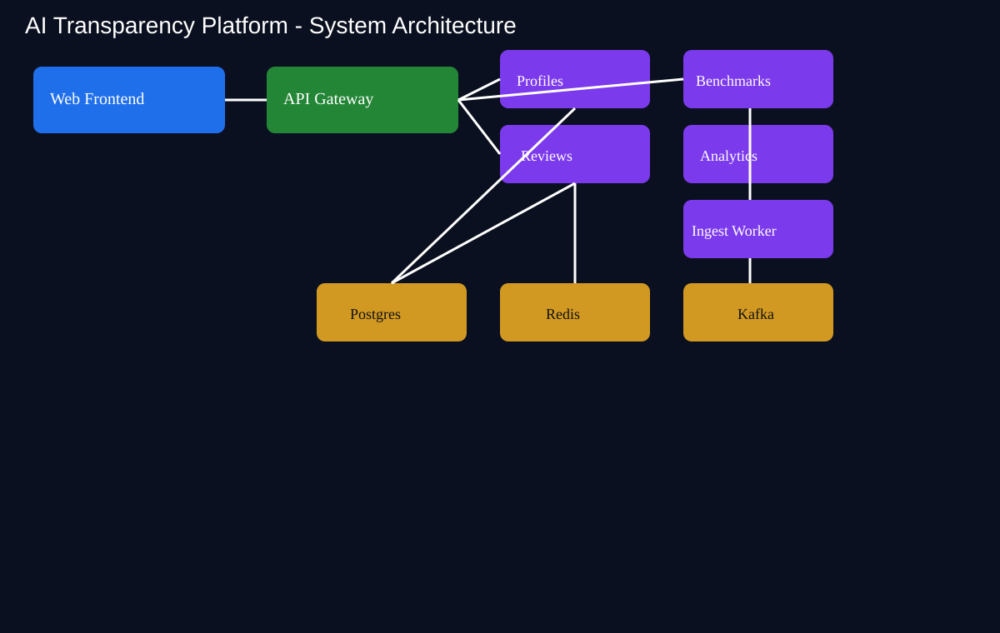
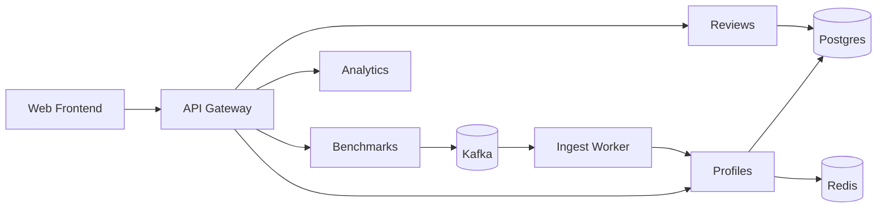
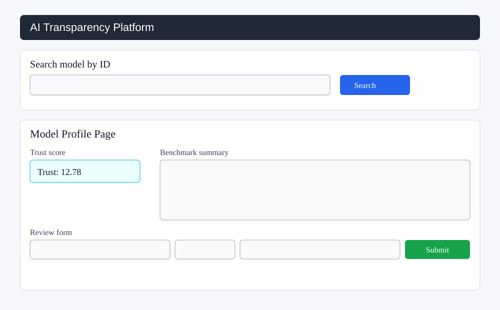

# AI Transparency Platform (ai-transparency)

This repository is a production-style monorepo scaffold for publishing, evaluating, and scoring AI models with provenance, benchmarks, human reviews, and auditability.

---

## 1) Product vision

The platform gives each model a profile and continuously enriches it with:

- **Provenance** (where data came from, how it was collected, license posture, score)
- **Benchmarks** (direct ingest or Kafka async pipeline)
- **Reviews** (human feedback with ratings/tags)
- **Risk analytics** (hallucination probability model)
- **Trust score** (single deterministic aggregate score)

This architecture mirrors how a real product team and platform team would split responsibilities across domain services.

---

## 2) System architecture

### Core service responsibilities

1. **profiles** (Node/TypeScript + Postgres + Redis)
   - Source of truth for model records, benchmarks, trust score, and audit log writes.
   - Enforces provenance schema and cache policy.

2. **benchmarks** (FastAPI)
   - Front-door for external benchmark submissions.
   - Supports two ingestion modes:
     - `kafka` (default): emits to `benchmarks` topic.
     - `direct`: forwards straight to profiles.

3. **ingest-worker** (Python)
   - Kafka consumer with retry/backoff.
   - PII pattern detection (email/SSN) and metric enrichment.

4. **reviews** (Node/TypeScript)
   - Accepts human reviews and triggers trust recomputation.

5. **analytics** (FastAPI + scikit-learn)
   - Hosts `/predict_hallucination` endpoint.
   - Trains and loads model artifact from local CSV dataset.

6. **web-frontend** (Next.js)
   - Model search and model details page with review submission.
   - API proxy routes to profiles/reviews.

### Scoring formula

`trust_score = 0.5*benchmark_score + 0.3*provenance_score + 0.15*audit_score + 0.05*user_sentiment + 12`

---

## 3) Developer workflow

```bash
make up
make seed
make smoke
```

Other useful commands:

```bash
make logs
make ps
make down
make test
```

---

## 4) File-by-file explanation (what + why + how)

> You asked for detailed explanation for each file in this project. This section covers every tracked file in the monorepo.

### Root

- **`.env.example`**: central list of environment variables across services (DB, Redis, Kafka, URLs). Why: keeps runtime contract explicit and portable between local/CI/K8s.
- **`.github/workflows/ci.yml`**: CI pipeline that runs Node tests (profiles/reviews) and Python tests (benchmarks/analytics). Why: verifies cross-language service quality gates.
- **`Makefile`**: one-command UX (`up/down/logs/ps/seed/smoke/test`). Why: standardizes commands for developers and reduces onboarding friction.
- **`README.md`**: architecture, runbook, and full file-level guide. Why: engineering + product shared source of truth.
- **`docker-compose.yml`**: local orchestration for platform dependencies and all services. Why: reproducible multi-service runtime.

### Frontend (`apps/web-frontend`)

- **`Dockerfile`**: builds/runs Next.js app in container. Why: consistent deploy/runtime image.
- **`next-env.d.ts`**: Next.js TypeScript ambient declarations. Why: TS compatibility with Next internals.
- **`next.config.js`**: Next runtime settings (strict mode). Why: safer UI runtime behavior.
- **`package.json`**: frontend dependencies/scripts. Why: lock-in app runtime/tooling contract.
- **`tsconfig.json`**: TS compile policy for Next pages app. Why: type safety and IDE tooling.
- **`pages/index.tsx`**: simple entry/search page. Why: allows model lookup by ID quickly.
- **`pages/models/[id].tsx`**: model profile UI + review submission form. How: fetches model details through proxy and posts review.
- **`pages/api/proxy/[...path].ts`**: backend routing proxy to profiles/reviews. Why: hides service topology from browser and centralizes API mapping.

### Infrastructure (`infra`)

- **`infra/sql/001_init.sql`**: bootstrap schema for models, benchmark_runs, reviews, audit_logs. Why: deterministic first-boot database shape.
- **`infra/k8s/configmap.yaml`**: non-secret shared runtime config for services. Why: twelve-factor configuration in K8s.
- **`infra/k8s/secret.yaml`**: secret placeholders for DB credentials. Why: sensitive configuration separation.
- **`infra/k8s/profiles.yaml`**: deployment/service for profiles API.
- **`infra/k8s/benchmarks.yaml`**: deployment/service for benchmark ingest API.
- **`infra/k8s/reviews.yaml`**: deployment/service for review API.
- **`infra/k8s/analytics.yaml`**: deployment/service for analytics inference API.
- **`infra/k8s/web-frontend.yaml`**: deployment/service for frontend UI.
- **`infra/k8s/ingress.yaml`**: ingress skeleton for external routing (nginx class).
- **`infra/terraform/main.tf`**: IaC starter with provider/version scaffolding. Why: path to managed cloud infra.

### Shared library

- **`libs/common/README.md`**: placeholder for shared schemas/types contracts. Why: eventual centralization of cross-service contracts.

### Developer scripts

- **`scripts/wait-for-http.sh`**: readiness gate utility with timeout. Why: deterministic automation when services start asynchronously.
- **`scripts/seed.sh`**: creates model + benchmark + review end-to-end and persists model id. Why: repeatable demo data and smoke precondition.
- **`scripts/smoke.sh`**: verifies read path output and trust score presence for seeded model. Why: minimal acceptance test for integrated flow.

### Analytics service (`services/analytics`)

- **`Dockerfile`**: python runtime image, installs deps, runs training, starts API.
- **`requirements.txt`**: FastAPI + sklearn + test deps.
- **`data/hallucination_labels.csv`**: tiny supervised dataset for local training artifact.
- **`train.py`**: training pipeline function (`train_model`) writing `models/hallucination_model.pkl`. Why: deterministic artifact generation.
- **`main.py`**: inference API with startup lazy-training if artifact missing. Why: self-healing local startup and simple ML serving path.
- **`test_analytics_main.py`**: endpoint test using TestClient and explicit module loading. Why: avoids naming collisions and validates API behavior.

### Benchmarks service (`services/benchmarks`)

- **`Dockerfile`**: container runtime for ingest API.
- **`requirements.txt`**: FastAPI, Kafka client, pytest stack.
- **`main.py`**: validated ingest endpoint with typed payload, metric constraints, Kafka/direct mode, and broker fallback. Why: robust edge ingestion.
- **`test_main.py`**: health and validation test coverage for ingest contract.

### Ingest worker (`services/ingest-worker`)

- **`Dockerfile`**: worker container image.
- **`requirements.txt`**: Kafka and HTTP client deps.
- **`worker.py`**: consumes topic, flags potential PII, retries writes to profiles. Why: resilient async pipeline semantics.

### Profiles service (`services/profiles`)

- **`Dockerfile`**: build and run TypeScript API.
- **`package.json`**: dependencies/scripts for build/dev/test.
- **`tsconfig.json`**: TS compile output + decorator metadata compatibility.
- **`jest.config.js`**: Jest + ts-jest configuration.
- **`src/provenanceSchema.ts`**: AJV schema contract for `training_data`.
- **`src/auth.ts`**: token and role middleware (`requireAuth`, `requireRole`) for mutating APIs.
- **`src/workflow.ts`**: workflow transition state machine (`draft/submitted/approved/rejected`).
- **`src/trust.ts`**: deterministic trust score function. Why: auditable and testable formula isolation.
- **`src/index.ts`**: full API surface, Redis cache policy, trust recompute, benchmark/review summaries, and audit log writes.
- **`tests/provenance.test.ts`**: validation test for missing provenance fields.
- **`tests/trust.test.ts`**: deterministic scoring unit test.
- **`tests/auth.test.ts`**: role middleware behavior test.
- **`tests/workflow.test.ts`**: transition rule tests.

### Reviews service (`services/reviews`)

- **`Dockerfile`**: build and run review API container.
- **`package.json`**: dependencies/scripts for reviews service.
- **`tsconfig.json`**: TS settings for compile/runtime.
- **`jest.config.js`**: jest setup.
- **`src/index.ts`**: review creation/listing endpoints, rating validation, trust recompute trigger, error middleware.
- **`tests/reviews.test.ts`**: rating rule tests.

### Lockfiles

- **`services/profiles/package-lock.json`**: deterministic dependency lock for profiles service build/test reproducibility.
- **`services/reviews/package-lock.json`**: deterministic dependency lock for reviews service build/test reproducibility.

### Misc

- **`tests/README.md`**: placeholder for future E2E/regression suites.

---

## 5) Why this code works today

- API contracts are explicit and validated (AJV/Pydantic).
- Cross-service integration path is runnable in Compose.
- Async/event path exists (benchmarks -> Kafka -> ingest-worker -> profiles).
- Trust score recomputation ties benchmarks + reviews + provenance.
- CI executes core Node + Python tests every push/PR.

---

## 6) Senior-level next steps (to evolve toward enterprise-grade)

1. Introduce message schemas with versioning (Avro/JSON Schema registry).
2. Add OpenTelemetry traces + structured logging + correlation IDs.
3. Add migration management (Alembic/TypeORM migrations) and seed fixtures.
4. Replace direct SQL coupling across services with API-only ownership boundaries.
5. Add API gateway with authn/authz and rate limiting.
6. Add contract tests and end-to-end Playwright tests.
7. Add model cards, compliance evidence bundles, and immutable audit storage.


---

## 7) Authentication and workflow governance

### Authentication model

- Mutating endpoints require `Authorization: Bearer <AUTH_TOKEN>` (default `dev-token`).
- Role-based header `x-user-role` controls privileged actions:
  - `publisher` can create models and submit workflow.
  - `auditor` can ingest benchmarks and approve/reject workflow.
  - `admin` can perform both.

### Workflow endpoints

- `POST /models/:id/workflow/submit` (publisher/admin)
- `POST /models/:id/workflow/approve` (auditor/admin, body `{"decision":"approve|reject"}`)
- `GET /models/:id/workflow` (authenticated)

Workflow transitions:
`draft -> submitted -> approved|rejected`, and `rejected -> draft`.

This introduces governance guardrails similar to enterprise model onboarding workflows.


---

## 8) API gateway, schema registry, and enterprise testing additions

### API gateway

- New `apps/api-gateway` service centralizes authn/authz and edge rate limiting.
- Downstream routes:
  - `/profiles/*`
  - `/reviews/*`
  - `/benchmarks/*`
  - `/analytics/*`

### Message schemas + versioning

- Canonical event schema in `libs/common/schemas/benchmark-ingest.v1.json`.
- Payloads now include `schema_version` and are validated before publish.
- Registry conventions documented in `libs/common/registry/README.md`.

### API-only ownership boundary step

- Profiles now consumes reviews via HTTP (`/models/:id/reviews` + `/summary`) instead of reading reviews table directly for trust/read-path composition.

### Contract + E2E test scaffolding

- Contract tests: `tests/contract/test_benchmark_schema.py`.
- E2E skeleton: `tests/e2e/playwright.config.ts` and `tests/e2e/model-flow.spec.ts`.

### Compliance and immutable evidence

- Added model-card endpoints and compliance evidence endpoints in profiles.
- Added SQL migration for `model_cards` and `compliance_evidence`.
- Audit logs now chain payload metadata with previous hash context for stronger tamper evidence.


---

## 9) Architectural, technology, codebase, and webpage overview (requested)

### Architectural overview

Detailed architecture write-up: `docs/architecture-overview.md`.

#### Diagram





### Tech stack overview

See `docs/tech-stack-overview.md` for a concise layer-by-layer stack map.

### Code overview

See `docs/code-overview.md` for subsystem responsibilities and folder-by-folder ownership.

### Final product webpage + HTML/CSS overview

- UI overview and structure: `docs/web-ui-overview.md`
- Wireframe picture:



- HTML/CSS implementation references:
  - Home page: `apps/web-frontend/pages/index.tsx`
  - Model page: `apps/web-frontend/pages/models/[id].tsx`
  - API proxy: `apps/web-frontend/pages/api/proxy/[...path].ts`

### Diagram and pictures included

- Architecture picture: `docs/diagrams/architecture.svg`
- Webpage wireframe picture: `docs/diagrams/webpage-wireframe.svg`
- Mermaid architecture diagram in this README section.
